# AgriMarket System Diagrams

This document contains various diagrams illustrating the architecture and data relationships of the AgriMarket e-commerce system.

## Table of Contents
- [Conceptual Diagram](#conceptual-diagram)
- [Entity-Relationship Diagram](#entity-relationship-diagram)
- [Physical Data Model](#physical-data-model)
- [Database Table Visualizations](#database-table-visualizations)
- [System Architecture Diagram](#system-architecture-diagram)
- [User Flow Diagram](#user-flow-diagram)
- [Component Diagram](#component-diagram)
- [Use Case Diagram](#use-case-diagram)
- [Sequence Diagrams](#sequence-diagrams)
- [Deployment Diagram](#deployment-diagram)
- [Context Diagram](#context-diagram)
- [Data Flow Diagram](#data-flow-diagram)

## Conceptual Diagram

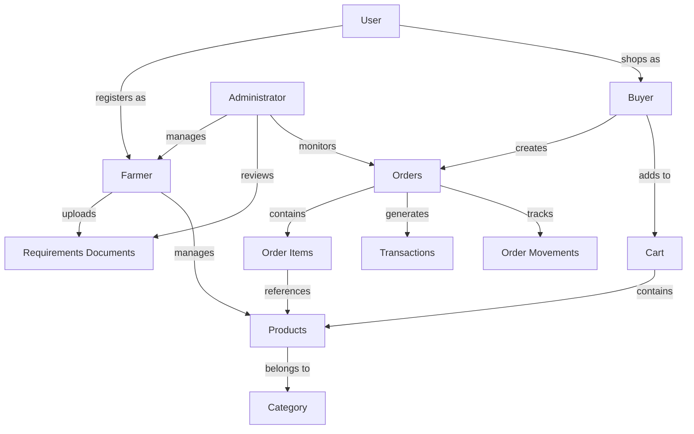

## Entity-Relationship Diagram

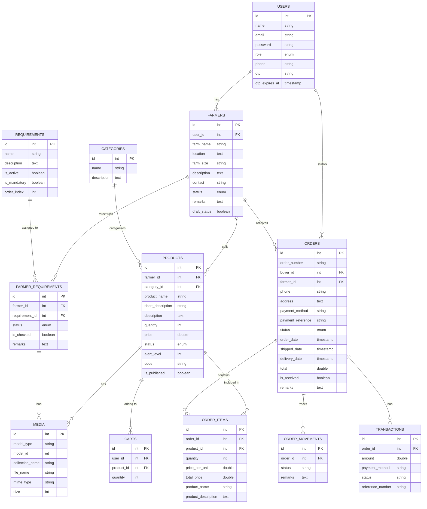

## Physical Data Model

```mermaid
classDiagram
    class users {
        +id: bigint(20) PK
        +name: varchar(255)
        +email: varchar(255)
        +email_verified_at: timestamp
        +password: varchar(255)
        +two_factor_secret: text
        +two_factor_recovery_codes: text
        +remember_token: varchar(100)
        +created_at: timestamp
        +updated_at: timestamp
        +otp: varchar(255)
        +otp_expires_at: timestamp
    }
    
    class farmers {
        +id: bigint(20) PK
        +user_id: bigint(20) FK
        +farm_name: varchar(255)
        +location: text
        +farm_size: varchar(255)
        +description: text
        +contact: varchar(255)
        +status: enum
        +remarks: text
        +created_at: timestamp
        +updated_at: timestamp
        +draft_status: boolean
    }
    
    class requirements {
        +id: bigint(20) PK
        +name: varchar(255)
        +description: text
        +is_active: boolean
        +is_mandatory: boolean
        +order_index: int
        +created_at: timestamp
        +updated_at: timestamp
    }
    
    class farmer_requirements {
        +id: bigint(20) PK
        +farmer_id: bigint(20) FK
        +requirement_id: bigint(20) FK
        +status: enum
        +is_checked: boolean
        +remarks: text
        +created_at: timestamp
        +updated_at: timestamp
    }
    
    class categories {
        +id: bigint(20) PK
        +name: varchar(255)
        +description: text
        +created_at: timestamp
        +updated_at: timestamp
    }
    
    class products {
        +id: bigint(20) PK
        +farmer_id: bigint(20) FK
        +category_id: bigint(20) FK
        +product_name: varchar(255)
        +short_description: varchar(255)
        +description: text
        +quantity: bigint(20)
        +price: double
        +status: enum
        +alert_level: bigint(20)
        +code: varchar(255)
        +is_published: boolean
        +created_at: timestamp
        +updated_at: timestamp
    }
    
    class orders {
        +id: bigint(20) PK
        +order_number: varchar(255)
        +buyer_id: bigint(20) FK
        +farmer_id: bigint(20) FK
        +phone: varchar(255)
        +region: varchar(255)
        +province: varchar(255)
        +city_municipality: varchar(255)
        +barangay: varchar(255)
        +street: varchar(255)
        +zip_code: varchar(255)
        +payment_method: varchar(255)
        +payment_reference: varchar(255)
        +status: enum
        +order_date: timestamp
        +shipped_date: timestamp
        +delivery_date: timestamp
        +total: double
        +is_received: boolean
        +remarks: text
        +created_at: timestamp
        +updated_at: timestamp
    }
    
    class order_items {
        +id: bigint(20) PK
        +order_id: bigint(20) FK
        +product_id: bigint(20) FK
        +quantity: int
        +price_per_unit: double
        +total_price: double
        +subtotal: double
        +product_name: varchar(255)
        +product_description: text
        +short_description: varchar(255)
        +product_price: double
        +product_quantity: int
        +created_at: timestamp
        +updated_at: timestamp
    }
    
    class order_movements {
        +id: bigint(20) PK
        +order_id: bigint(20) FK
        +status: varchar(255)
        +remarks: text
        +created_at: timestamp
        +updated_at: timestamp
    }
    
    class carts {
        +id: bigint(20) PK
        +user_id: bigint(20) FK
        +product_id: bigint(20) FK
        +quantity: int
        +created_at: timestamp
        +updated_at: timestamp
    }
    
    class transactions {
        +id: bigint(20) PK
        +order_id: bigint(20) FK
        +amount: double
        +payment_method: varchar(255)
        +status: varchar(255)
        +reference_number: varchar(255)
        +created_at: timestamp
        +updated_at: timestamp
    }
    
    class media {
        +id: bigint(20) PK
        +model_type: varchar(255)
        +model_id: bigint(20)
        +uuid: varchar(36)
        +collection_name: varchar(255)
        +name: varchar(255)
        +file_name: varchar(255)
        +mime_type: varchar(255)
        +disk: varchar(255)
        +conversions_disk: varchar(255)
        +size: bigint(20)
        +manipulations: json
        +custom_properties: json
        +generated_conversions: json
        +responsive_images: json
        +order_column: int
        +created_at: timestamp
        +updated_at: timestamp
    }
    
    users "1" --> "0..1" farmers
    users "1" --> "*" orders
    farmers "1" --> "*" products
    farmers "1" --> "*" farmer_requirements
    requirements "1" --> "*" farmer_requirements
    categories "1" --> "*" products
    products "1" --> "*" order_items
    products "1" --> "*" carts
    orders "1" --> "*" order_items
    orders "1" --> "*" order_movements
    orders "1" --> "*" transactions
    farmers "1" --> "*" orders
```

## System Architecture Diagram

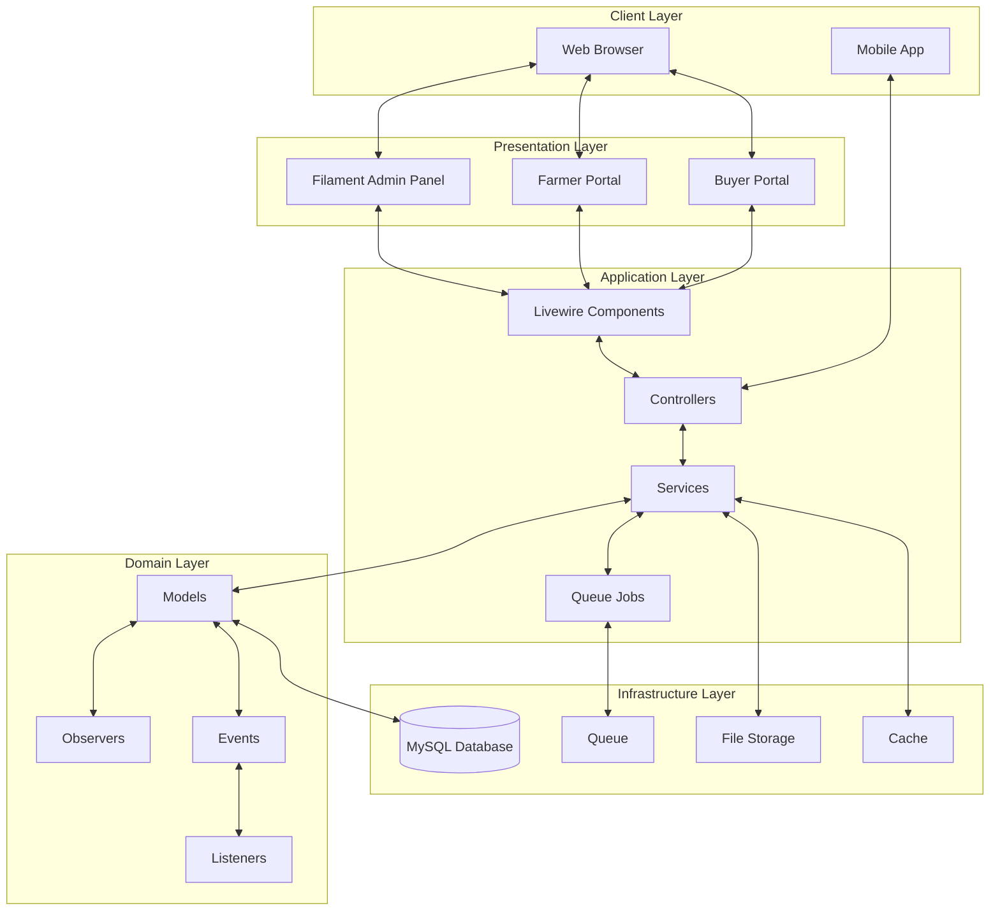

## User Flow Diagram

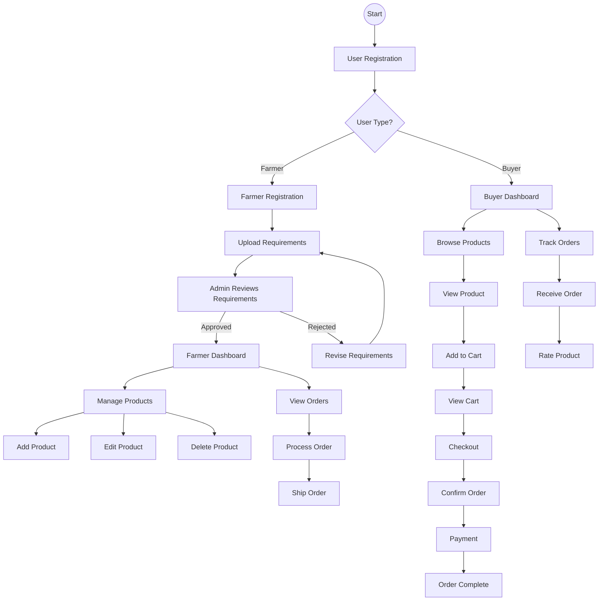

## Component Diagram

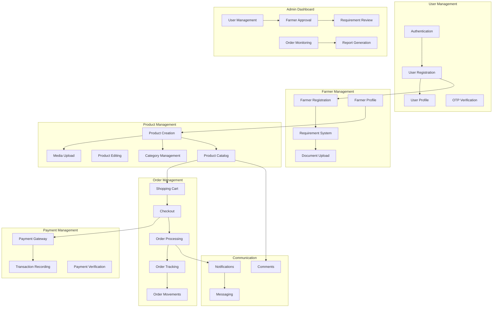

## Database Table Visualizations

### Users Table

| Column Name | Data Type | Constraints | Description |
|------------|-----------|-------------|-------------|
| id | bigint(20) | PRIMARY KEY | Unique identifier for users |
| name | varchar(255) | NOT NULL | User's full name |
| email | varchar(255) | UNIQUE, NOT NULL | User's email address |
| email_verified_at | timestamp | NULL | When email was verified |
| password | varchar(255) | NOT NULL | Hashed password |
| remember_token | varchar(100) | NULL | Token for "remember me" functionality |
| created_at | timestamp | NULL | Record creation timestamp |
| updated_at | timestamp | NULL | Record update timestamp |
| otp | varchar(255) | NULL | One-time password for verification |
| otp_expires_at | timestamp | NULL | OTP expiration time |

### Farmers Table

| Column Name | Data Type | Constraints | Description |
|------------|-----------|-------------|-------------|
| id | bigint(20) | PRIMARY KEY | Unique identifier for farmers |
| user_id | bigint(20) | FOREIGN KEY | Reference to users table |
| farm_name | varchar(255) | NULL | Name of the farm |
| location | text | NULL | Farm location details |
| farm_size | varchar(255) | NULL | Size of the farm |
| description | text | NULL | Description of the farm |
| contact | varchar(255) | NULL | Contact information |
| status | enum | DEFAULT 'Pending' | Status of farmer registration |
| remarks | text | NULL | Additional notes |
| created_at | timestamp | NULL | Record creation timestamp |
| updated_at | timestamp | NULL | Record update timestamp |
| draft_status | boolean | DEFAULT false | Whether profile is in draft mode |

### Products Table

| Column Name | Data Type | Constraints | Description |
|------------|-----------|-------------|-------------|
| id | bigint(20) | PRIMARY KEY | Unique identifier for products |
| farmer_id | bigint(20) | FOREIGN KEY | Reference to farmers table |
| category_id | bigint(20) | FOREIGN KEY, NULL | Reference to categories table |
| product_name | varchar(255) | NULL | Name of the product |
| short_description | varchar(255) | NULL | Brief product description |
| description | text | NULL | Detailed product description |
| quantity | bigint(20) | NULL | Available quantity |
| price | double | NULL | Product price |
| status | enum | DEFAULT 'Available' | Product availability status |
| alert_level | bigint(20) | DEFAULT 20 | Inventory alert threshold |
| code | varchar(255) | UNIQUE, NULL | Product code |
| is_published | boolean | DEFAULT true | Whether product is visible |
| created_at | timestamp | NULL | Record creation timestamp |
| updated_at | timestamp | NULL | Record update timestamp |

### Orders Table

| Column Name | Data Type | Constraints | Description |
|------------|-----------|-------------|-------------|
| id | bigint(20) | PRIMARY KEY | Unique identifier for orders |
| order_number | varchar(255) | UNIQUE, NULL | Order reference number |
| buyer_id | bigint(20) | FOREIGN KEY | Reference to users table |
| farmer_id | bigint(20) | FOREIGN KEY, NULL | Reference to farmers table |
| phone | varchar(255) | NULL | Contact phone number |
| region | varchar(255) | NULL | Delivery region |
| province | varchar(255) | NULL | Delivery province |
| city_municipality | varchar(255) | NULL | Delivery city/municipality |
| barangay | varchar(255) | NULL | Delivery barangay |
| street | varchar(255) | NULL | Delivery street address |
| zip_code | varchar(255) | NULL | Delivery postal code |
| payment_method | varchar(255) | NULL | Method of payment |
| payment_reference | varchar(255) | NULL | Payment reference number |
| status | enum | DEFAULT 'Processing' | Order status |
| order_date | timestamp | DEFAULT CURRENT_TIMESTAMP | Date order was placed |
| shipped_date | timestamp | NULL | Date order was shipped |
| delivery_date | timestamp | NULL | Date order was delivered |
| total | double | NULL | Total order amount |
| is_received | boolean | DEFAULT false | Whether order was received |
| remarks | text | NULL | Additional notes |
| created_at | timestamp | NULL | Record creation timestamp |
| updated_at | timestamp | NULL | Record update timestamp |

### Requirements Table

| Column Name | Data Type | Constraints | Description |
|------------|-----------|-------------|-------------|
| id | bigint(20) | PRIMARY KEY | Unique identifier for requirements |
| name | varchar(255) | NOT NULL | Name of the requirement |
| description | text | NULL | Description of the requirement |
| is_active | boolean | DEFAULT true | Whether requirement is active |
| is_mandatory | boolean | DEFAULT true | Whether requirement is mandatory |
| order_index | int | DEFAULT 0 | Display order |
| created_at | timestamp | NULL | Record creation timestamp |
| updated_at | timestamp | NULL | Record update timestamp |

### Farmer Requirements Table

| Column Name | Data Type | Constraints | Description |
|------------|-----------|-------------|-------------|
| id | bigint(20) | PRIMARY KEY | Unique identifier |
| farmer_id | bigint(20) | FOREIGN KEY | Reference to farmers table |
| requirement_id | bigint(20) | FOREIGN KEY | Reference to requirements table |
| status | enum | DEFAULT 'Pending' | Status of requirement fulfillment |
| is_checked | boolean | DEFAULT false | Whether requirement has been reviewed |
| remarks | text | NULL | Additional notes |
| created_at | timestamp | NULL | Record creation timestamp |
| updated_at | timestamp | NULL | Record update timestamp |

### Order Items Table

| Column Name | Data Type | Constraints | Description |
|------------|-----------|-------------|-------------|
| id | bigint(20) | PRIMARY KEY | Unique identifier |
| order_id | bigint(20) | FOREIGN KEY | Reference to orders table |
| product_id | bigint(20) | FOREIGN KEY | Reference to products table |
| quantity | int | NULL | Quantity ordered |
| price_per_unit | double | NULL | Price per unit |
| total_price | double | NULL | Total price for item |
| subtotal | double | NULL | Subtotal for item |
| product_name | varchar(255) | NULL | Snapshot of product name |
| product_description | text | NULL | Snapshot of product description |
| short_description | varchar(255) | NULL | Snapshot of short description |
| product_price | double | NULL | Snapshot of product price |
| product_quantity | int | NULL | Snapshot of product quantity |
| created_at | timestamp | NULL | Record creation timestamp |
| updated_at | timestamp | NULL | Record update timestamp |

### Database Relationship Visualization

```
+---------------+     +---------------+     +---------------+
|    Users      |     |    Farmers    |     | Requirements  |
+---------------+     +---------------+     +---------------+
| id            |<--->| id            |     | id            |
| name          |     | user_id       |<--->| name          |
| email         |     | farm_name     |     | description   |
| password      |     | location      |     | is_active     |
| otp           |     | farm_size     |     | is_mandatory  |
| otp_expires_at|     | description   |     | order_index   |
+---------------+     | contact       |     +---------------+
        ^             | status        |            ^
        |             | remarks       |            |
        |             | draft_status  |            |
        |             +---------------+            |
        |                     ^                   |
        |                     |                   |
        |                     v                   |
+---------------+     +---------------+     +---------------+
|    Orders     |     |   Products    |     | Farmer_Reqs   |
+---------------+     +---------------+     +---------------+
| id            |     | id            |     | id            |
| order_number  |     | farmer_id     |     | farmer_id     |
| buyer_id      |     | category_id   |     | requirement_id|
| farmer_id     |<--->| product_name  |     | status        |
| phone         |     | description   |     | is_checked    |
| address       |     | quantity      |     | remarks       |
| payment_method|     | price         |     +---------------+
| status        |     | status        |            ^
| total         |     | code          |            |
+---------------+     | is_published  |            |
        ^             +---------------+            |
        |                     ^                   |
        |                     |                   |
        |                     v                   v
+---------------+     +---------------+     +---------------+
| Order_Items   |     |    Carts      |     |    Media      |
+---------------+     +---------------+     +---------------+
| id            |     | id            |     | id            |
| order_id      |     | user_id       |     | model_type    |
| product_id    |<--->| product_id    |     | model_id      |
| quantity      |     | quantity      |     | collection_name|
| price_per_unit|     +---------------+     | file_name     |
| total_price   |                           | mime_type     |
| product_name  |                           | size          |
+---------------+                           +---------------+
```

These diagrams and table visualizations provide a comprehensive view of the AgriMarket e-commerce system, showing the relationships between entities, the system architecture, and user flows. The diagrams use the Mermaid syntax for visualization and can be rendered in any Markdown viewer that supports Mermaid diagrams.

## Use Case Diagram

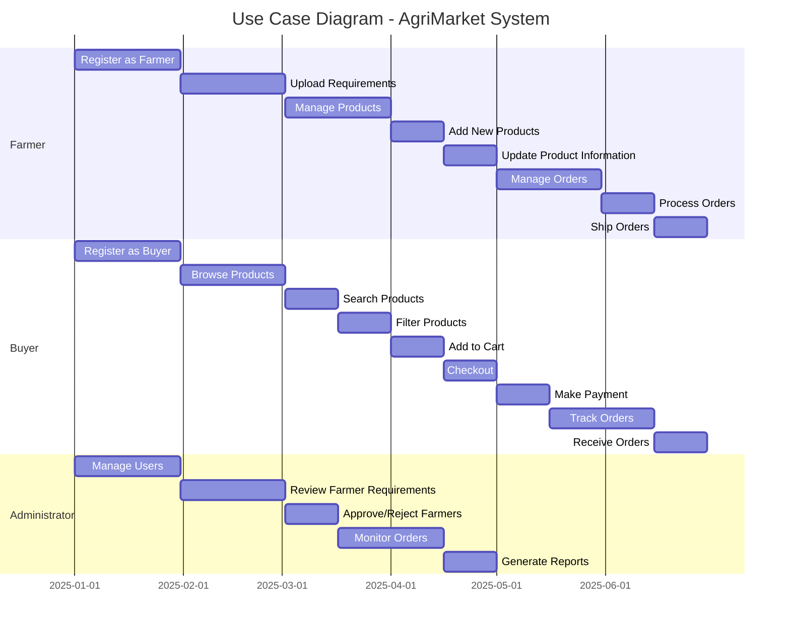

### ASCII Use Case Diagram

```
+-------------------+    +-------------------+    +-------------------+
|      FARMER       |    |       BUYER       |    |   ADMINISTRATOR   |
+-------------------+    +-------------------+    +-------------------+
| - Register        |    | - Register        |    | - Manage Users    |
| - Upload Docs     |    | - Browse Products |    | - Review Docs     |
| - Manage Products |    | - Search Products |    | - Approve/Reject  |
| - Add Products    |    | - Add to Cart     |    | - Monitor Orders  |
| - Update Products |    | - Checkout        |    | - Generate Reports|
| - Process Orders  |    | - Make Payment    |    +-------------------+
| - Ship Orders     |    | - Track Orders    |
+-------------------+    | - Receive Orders  |
                         +-------------------+
```

## Sequence Diagrams

### Farmer Registration Sequence

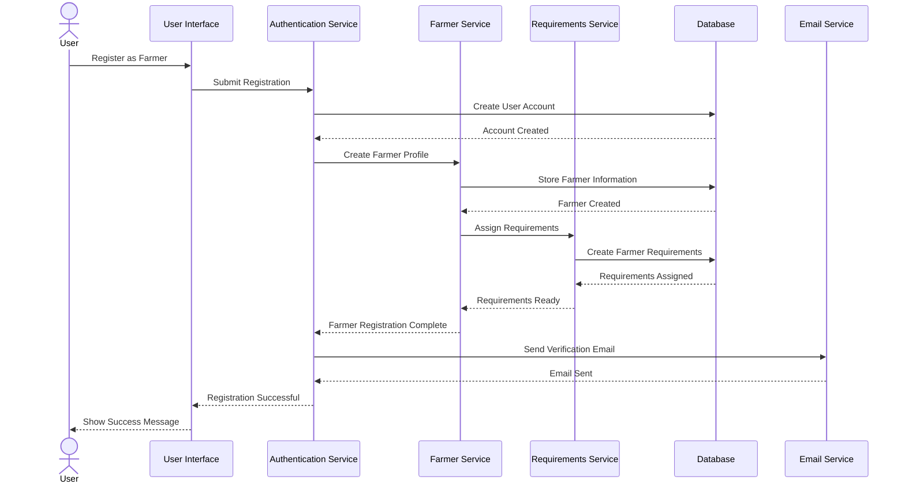

### ASCII Farmer Registration Sequence

```
User          UI          Auth        FarmerSvc    ReqSvc       DB          Email
 |             |            |            |            |            |            |
 |--Register-->|            |            |            |            |            |
 |             |--Submit--->|            |            |            |            |
 |             |            |--Create--->|            |            |            |
 |             |            |<--Created--|            |            |            |
 |             |            |--Create------------------>|            |            |
 |             |            |            |            |--Store----->|            |
 |             |            |            |            |<--Created---|            |
 |             |            |            |--Assign--->|            |            |
 |             |            |            |            |--Create---->|            |
 |             |            |            |            |<--Assigned--|            |
 |             |            |            |<--Ready----|            |            |
 |             |            |<--Complete-|            |            |            |
 |             |            |--Send------------------------------>|            |
 |             |            |<--Sent------------------------------|            |
 |             |<--Success--|            |            |            |            |
 |<--Success-->|            |            |            |            |            |
 |             |            |            |            |            |            |
```

### Order Processing Sequence

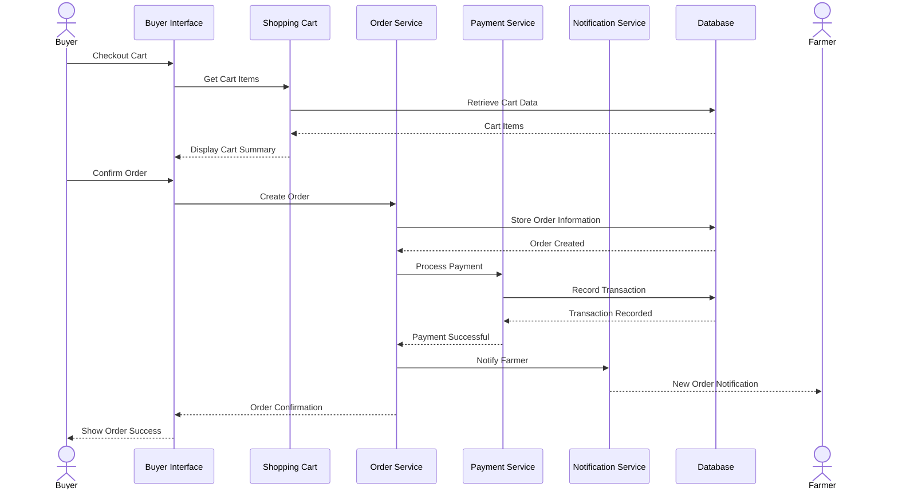

### ASCII Order Processing Sequence

```
Buyer         UI           Cart         Order        Payment      Notif        DB           Farmer
 |             |             |             |             |             |             |             |
 |--Checkout-->|             |             |             |             |             |             |
 |             |--Get Items-->|             |             |             |             |             |
 |             |             |--Retrieve--->|             |             |             |             |
 |             |             |<--Items------|             |             |             |             |
 |             |<--Summary---|             |             |             |             |             |
 |--Confirm--->|             |             |             |             |             |             |
 |             |--Create-------------------->|             |             |             |             |
 |             |             |             |--Store--------------------->|             |             |
 |             |             |             |<--Created------------------|             |             |
 |             |             |             |--Process---->|             |             |             |
 |             |             |             |             |--Record----->|             |             |
 |             |             |             |             |<--Recorded---|             |             |
 |             |             |             |<--Success---|             |             |             |
 |             |             |             |--Notify-------------------->|             |             |
 |             |             |             |             |             |--Notify-------------------->|
 |             |<--Confirm---|             |             |             |             |             |
 |<--Success-->|             |             |             |             |             |             |
 |             |             |             |             |             |             |             |
```

## Deployment Diagram

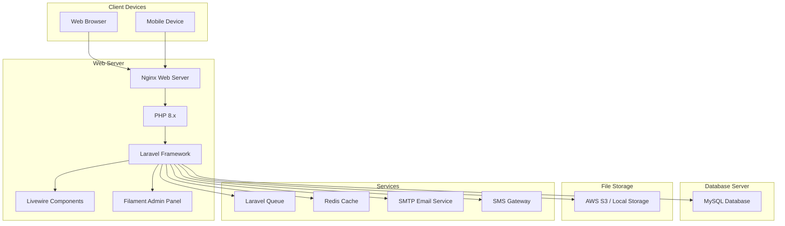

### ASCII Deployment Diagram

```
+------------------+     +------------------+
|  Client Devices  |     |   Web Server    |
+------------------+     +------------------+
| - Web Browser    |---->| - Nginx         |
| - Mobile Device  |     | - PHP 8.x       |
+------------------+     | - Laravel       |----+
                         | - Livewire      |    |
                         | - Filament      |    |
                         +------------------+    |
                                |                |
                                v                v
+------------------+     +------------------+    |    +------------------+
| Database Server  |<----| Services         |<---+----| File Storage     |
+------------------+     +------------------+         +------------------+
| - MySQL Database |     | - Laravel Queue |         | - AWS S3         |
+------------------+     | - Redis Cache   |         | - Local Storage  |
                         | - SMTP Email    |         +------------------+
                         | - SMS Gateway   |
                         +------------------+
```

## Context Diagram

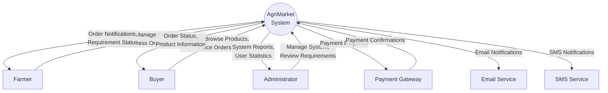

### ASCII Context Diagram

```
                 +--------------------+
                 |                    |
    +----------->|     AgriMarket     |<-----------+
    |            |      System        |            |
    |            |                    |            |
    |            +--------------------+            |
    |                ^    |     ^  |               |
    |                |    |     |  |               |
    |                |    v     |  v               |
+---+----+      +----+---+    ++---+--+      +----+---+
|        |      |        |    |       |      |        |
| Farmer |<---->| Buyer  |    | Admin |      | Payment|
|        |      |        |    |       |      | Gateway|
+--------+      +--------+    +-------+      +--------+
                                   ^
                                   |
                 +------------------+-------------+
                 |                  |             |
             +---+----+        +----+---+     +---+----+
             |        |        |        |     |        |
             | Email  |        |  SMS   |     | Other  |
             | Service|        | Service|     |Services|
             +--------+        +--------+     +--------+
```

## Data Flow Diagram

### Level 0 DFD

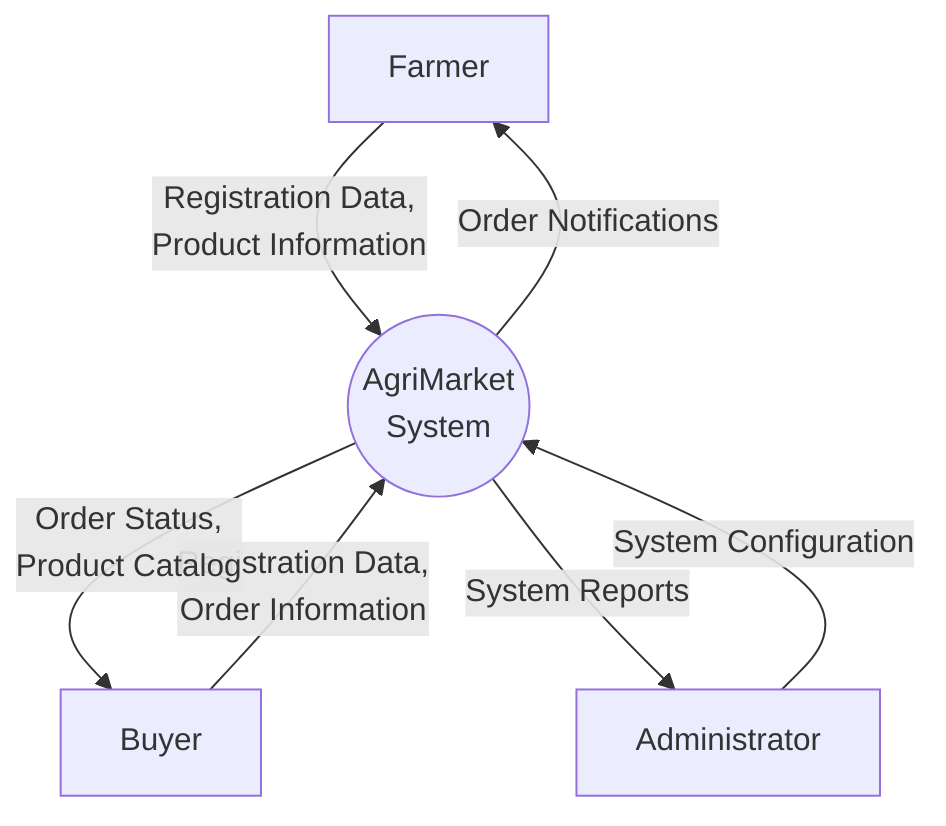

### ASCII Level 0 DFD

```
+---------+                              +---------+
|         |  Registration Data           |         |
| Farmer  |------------------------------>|         |
|         |  Product Information         |         |
+---------+                              |         |
                                         |         |
+---------+                              |         |
|         |  Registration Data           |         |
| Buyer   |------------------------------>|AgriMarket|
|         |  Order Information           | System  |
+---------+                              |         |
                                         |         |
+---------+                              |         |
|         |  System Configuration        |         |
| Admin   |------------------------------>|         |
|         |                              |         |
+---------+                              +---------+
              Order Notifications          |  |  |
              <-----------------------------+  |  |
                                               |  |
              Order Status, Product Catalog    |  |
              <-------------------------------+  |
                                                  |
              System Reports                      |
              <---------------------------------+
```

### Level 1 DFD

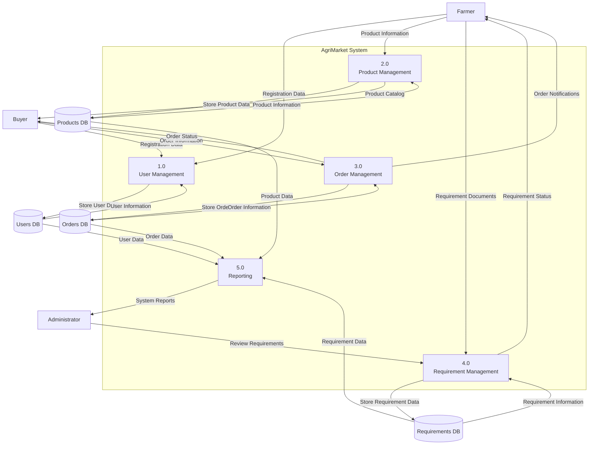

### ASCII Level 1 DFD

```
+--------+                                                  +--------+
|        |                                                  |        |
| Farmer |                                                  | Buyer  |
|        |                                                  |        |
+---+----+                                                  +----+---+
    |                                                            |
    |    +--------------------------------------------------+    |
    |    |                  AgriMarket System               |    |
    |    |  +----------+    +----------+    +----------+    |    |
    +--->|  |   1.0    |    |   2.0    |    |   3.0    |<---+    |
    |    |  |   User   |<-->|  Product |<-->|  Order   |    |    |
    |    |  |Management|    |Management|    |Management|---------+
    |    |  +-----+----+    +----+-----+    +-----+----+    |
    |    |        |              |                |          |
    |    |        v              v                v          |
    |    |  +----------+    +----------+    +----------+    |
    +--->|  |   4.0    |    |   5.0    |    |          |    |
         |  |Requirement|    | Reporting|<---|  Database|    |
+-----+  |  |Management|    |          |    |  Storage |    |
|     |  |  +----------+    +----------+    +----------+    |
|Admin|  |                                                   |
|     |  +---------------------------------------------------+
+-----+
```

These diagrams provide a comprehensive visualization of the AgriMarket e-commerce system from multiple perspectives, covering all aspects typically required in a capstone project. The diagrams use both Mermaid syntax for visualization (which can be rendered in any Markdown viewer that supports Mermaid diagrams) and ASCII art for direct viewing without special rendering tools.

These diagrams provide a comprehensive visualization of the AgriMarket e-commerce system from multiple perspectives, covering all aspects typically required in a capstone project. The diagrams use the Mermaid syntax for visualization and can be rendered in any Markdown viewer that supports Mermaid diagrams.
