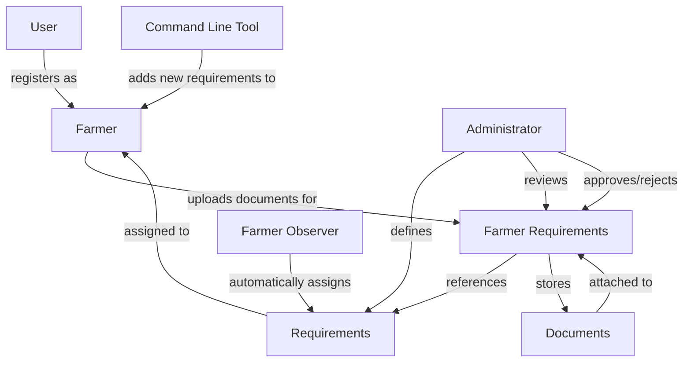
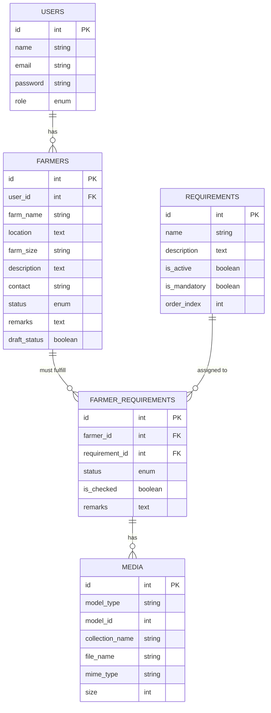
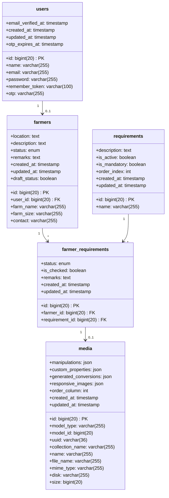
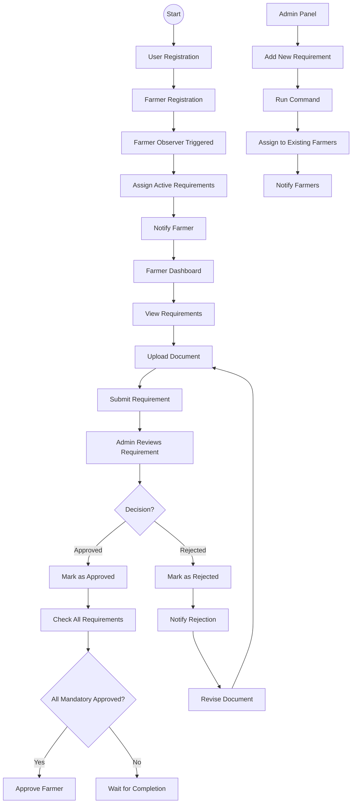
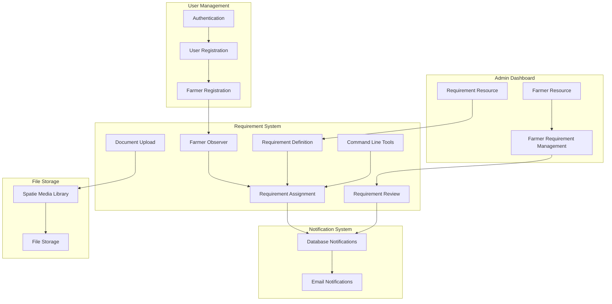
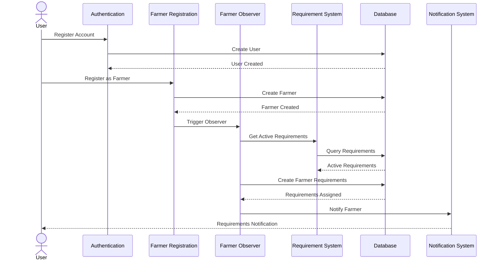
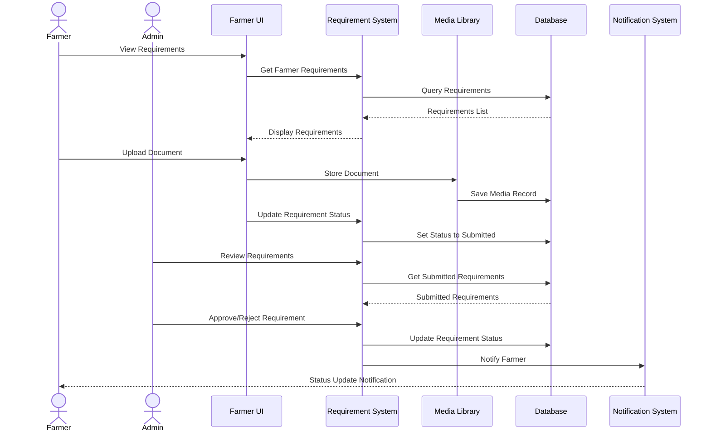
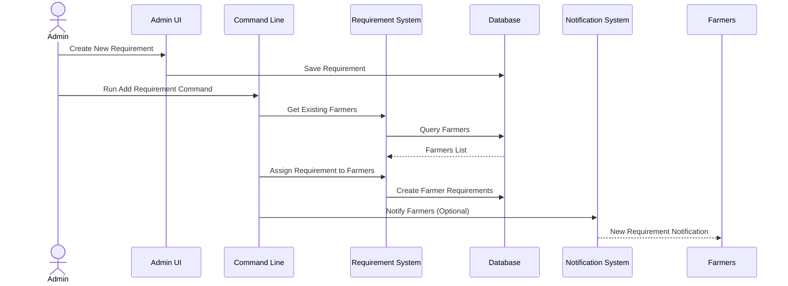

# Farmer Requirements System Diagrams

This document contains various diagrams illustrating the architecture and data relationships of the Farmer Requirements system within the AgriMarket e-commerce platform.

## Table of Contents
- [Conceptual Diagram](#conceptual-diagram)
- [Entity-Relationship Diagram](#entity-relationship-diagram)
- [Physical Data Model](#physical-data-model)
- [System Flow Diagram](#system-flow-diagram)
- [Component Diagram](#component-diagram)
- [Sequence Diagrams](#sequence-diagrams)
- [Database Table Visualizations](#database-table-visualizations)

## Conceptual Diagram



## Entity-Relationship Diagram



## Physical Data Model



## System Flow Diagram



## Component Diagram



## Sequence Diagrams

### Farmer Registration and Requirement Assignment



### Document Upload and Review Process



### Adding New Requirement to Existing Farmers



## Database Table Visualizations

### Requirements Table

| Column Name | Data Type | Constraints | Description |
|------------|-----------|-------------|-------------|
| id | bigint(20) | PRIMARY KEY | Unique identifier for requirements |
| name | varchar(255) | NOT NULL | Name of the requirement |
| description | text | NULL | Description of the requirement |
| is_active | boolean | DEFAULT true | Whether requirement is active |
| is_mandatory | boolean | DEFAULT true | Whether requirement is mandatory |
| order_index | int | DEFAULT 0 | Display order |
| created_at | timestamp | NULL | Record creation timestamp |
| updated_at | timestamp | NULL | Record update timestamp |

### Farmer Requirements Table

| Column Name | Data Type | Constraints | Description |
|------------|-----------|-------------|-------------|
| id | bigint(20) | PRIMARY KEY | Unique identifier for farmer requirements |
| farmer_id | bigint(20) | FOREIGN KEY | Reference to farmers table |
| requirement_id | bigint(20) | FOREIGN KEY | Reference to requirements table |
| status | enum | DEFAULT 'Pending' | Status of requirement (Pending, Submitted, Approved, Rejected) |
| is_checked | boolean | DEFAULT false | Whether requirement has been reviewed |
| remarks | text | NULL | Additional notes or feedback |
| created_at | timestamp | NULL | Record creation timestamp |
| updated_at | timestamp | NULL | Record update timestamp |

### Database Relationship Visualization

```
+---------------+     +---------------+     +---------------+
|    Users      |     |    Farmers    |     | Requirements  |
+---------------+     +---------------+     +---------------+
| id            |<--->| id            |     | id            |
| name          |     | user_id       |     | name          |
| email         |     | farm_name     |     | description   |
| password      |     | location      |     | is_active     |
|               |     | farm_size     |     | is_mandatory  |
|               |     | description   |     | order_index   |
|               |     | contact       |     |               |
|               |     | status        |     |               |
|               |     | remarks       |     |               |
+---------------+     +---------------+     +---------------+
                             ^                    ^
                             |                    |
                             v                    v
                      +---------------+     +---------------+
                      | Farmer_Reqs   |     |    Media      |
                      +---------------+     +---------------+
                      | id            |<--->| id            |
                      | farmer_id     |     | model_type    |
                      | requirement_id|     | model_id      |
                      | status        |     | collection_name|
                      | is_checked    |     | file_name     |
                      | remarks       |     | mime_type     |
                      +---------------+     | size          |
                                            +---------------+
```

These diagrams provide a comprehensive visualization of the Farmer Requirements system, showing the relationships between entities, the system architecture, and process flows. The diagrams use the Mermaid syntax for visualization and can be rendered in any Markdown viewer that supports Mermaid diagrams.
